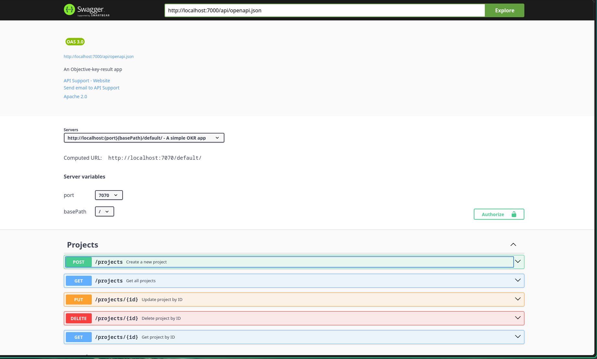
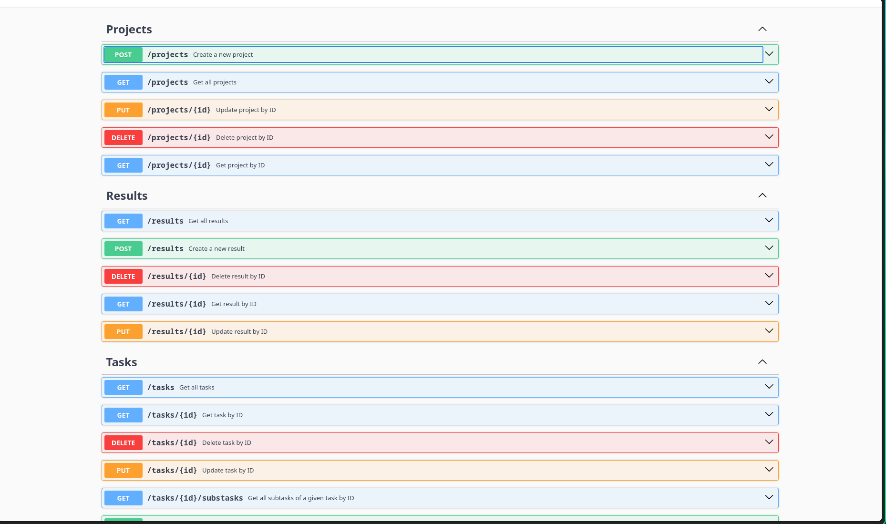
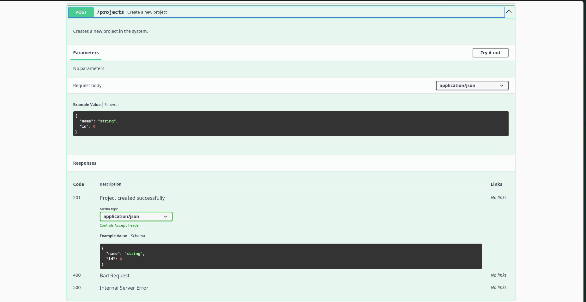

# ORK - A project management tool

<a name="readme-top"></a>

<details>
  <summary>Table of Contents</summary>
  <ol>
    <li>
        <a href="#built-with">Built With</a>
    </li>
    <li>
      <a href="#getting-started">Getting Started</a>
      <ul>
        <li><a href="#get-the-source-code">Get the source code</a></li>
        <li><a href="#documentation">Documentation</a></li>
        <li><a href="#requirements">Requirements</a></li>
        <li><a href="#setup-web-infrastructure">Setup web infrastructure</a></li>
        <li><a href="#development">Development<a></li>
        <li><a href="#usage">Usage<a></li>
      </ul>
    </li>
    <li><a href="#contributing">Contributions</a></li>
    <li><a href="#license">License</a></li>
    <li><a href="#contacts">Contacts</a></li>
  </ol>
</details>

## Built With

- [Java 21 temurin][java]
- [Maven][maven]
- [Docker][docker]
- [Javalin][javalin]

<p align="right">(<a href="#readme-top">back to top</a>)</p>

<!-- GETTING STARTED -->

## Getting Started

SimpFT is a simple file transfer application to upload and download files on a
server.

The client offers a `REPL` so you can type commands interactively. Options like the server address as well as the server port (on both server and client) can be specified.

You can also find the Protocol definition as a [pdf](./docs/proto.pdf) or [typst](./docs/proto.typ)

### Get the source code

First of all, download the source code:

```sh
git clone https://github.com/HEIG-VD-S3-PW/DAI-LAB-04
cd DAI-LAB-04
```

### Documentation

You will find all the information you need to use this application in this readme.

The code documentation is written with standard `javadoc`.

Also, the route's documentation (built with the [OpenAPI spec](https://swagger.io/specification/)) can be accessed throught the following url: <http://localhost:8085>. Then, you must specify the following url to fetch the **.json** file containing the documentation: <http://localhost:7000/api/openapi.json>

Notice, that these url's can only be accessed after launching the backend as the *SWAGGER-UI* client. Detailed instructions about how to do this can be found later in this document.

Here are some images of the **OpenAPI** documentation:





### Requirements

#### Java 21

- [asdf][asdf]

  ```sh
  # Install the plugin if needed
  asdf plugin add java
  # Install
  asdf install java latest:temurin-21
  ```

- Mac (homebrew)

  ```zsh
  brew tap homebrew/cask-versions
  brew install --cask temurin@21
  ```

- Windows (winget)

  ```ps
  winget install EclipseAdoptium.Temurin.21.JDK
  ```

#### Docker

The application can (and should) be used with docker.

To install and use docker, follow the [official documentation](https://docs.docker.com/engine/install/)

### Setup web infrastructure

First, create a virtual machine using your Azure account. To do so, select a virtual machine with the following characteristics from the creation menu:

- **Project details**
  - **Subscription**: Azure for Students
  - **Resource group**: Create new with the name `<YOUR_VM_NAME>`
- **Instance details**
  - **Virtual machine name**: `<YOUR_VM_NAME>`
  - **Region**: (Europe) West Europe
  - **Availability options**: No infrastructure redundancy required
  - **Security type**: Trusted launch virtual machines (the default)
  - **Image**: Ubuntu Server 24.04 LTS - x64 Gen2 (the default)
  - **VM architecture**: x64
  - **Size**: `Standard_B1s` - you might need to click *"See all sizes"* to see this option
- **Administrator account**
  - **Authentication type**: SSH public key
  - **Username**: `ubuntu`
  - **SSH public key source**: Use existing public key
  - **SSH public key**: Paste your public key here - see the note below for more information
- **Inbound port rules**
  - **Public inbound ports**: Allow selected ports
  - **Select inbound ports**: HTTP (80), HTTPS (443), SSH (22)
  
The settings above will allow you to create a virtual machine whose open ports are: 80, 443 and 22. Also, SSH connections require key-based authentication.

#### DNS

Once the VM created, you can grab its IP address and create a DNS entry for that same IP.

We used [duckdns.org](https://www.duckdns.org/) as our DNS service provider.

All you need to do is to create an account and fill the simple form on the main page with your domain name (in our case it was: **api-heig-dai-pw04**). Then, update the DNS  entry with the IP address of your VM.

##### Test the DNS resolution

Test the DNS resolution of the DNS records you added from the virtual machine and from your local machine.

```shell
# Test the DNS resolution
nslookup api-heig-dai-pw04.duckdns.org
```

```
Server:         10.193.64.16
Address:        10.193.64.16#53

Non-authoritative answer:
Name:   api-heig-dai-pw04.duckdns.org
Address: 135.236.100.168
```

#### Deployment

Even though the deployment instructions using docker can be found later in this document, all you need to do is:

1. Clone or copy (using scp) the source code to the remote server
2. Go to directory you have just created/copied and create a file named **.env** with the following content:

```env
# The fully qualified domain name to access whoami (first instance)
WHOAMI_1_FULLY_QUALIFIED_DOMAIN_NAME=api-heig-dai-pw04.duckdns.org

# The fully qualified domain name to access whoami (second instance)
#WHOAMI_2_FULLY_QUALIFIED_DOMAIN_NAME=heig-dai-pw04.duckdns.org

# The image version to use for whoami
WHOAMI_IMAGE_VERSION=latest
# The email address for Let's Encrypt
TRAEFIK_ACME_EMAIL=<YOUR_EMAIL>

# The fully qualified domain name to access Traefik
TRAEFIK_FULLY_QUALIFIED_DOMAIN_NAME=api-heig-dai-pw04.duckdns.org

# Enable the Traefik dashboard
TRAEFIK_ENABLE_DASHBOARD=true

# The image version to use for Traefik
TRAEFIK_IMAGE_VERSION=latest
```

Also, create a file named **credentials.txt** whose purpose is to store the database credentials.

Then, simply run the command to launch our application as well as all its dependencies:

```sh
sudo docker compose --profile prod up --build
```

##### Testing the web app

In order to prove that all services (http/s + ssh) are running, we can run the following command:

```sh
 sudo nmap api-heig-dai-pw04.duckdns.org
```

```
Nmap scan report for api-heig-dai-pw04.duckdns.org (135.236.100.168)
Host is up (0.020s latency).
Not shown: 997 filtered tcp ports (no-response)
PORT    STATE SERVICE
22/tcp  open  ssh
80/tcp  open  http
443/tcp open  https

Nmap done: 1 IP address (1 host up) scanned in 5.04 seconds
```

Then, we can use **CURL** to make some HTTP requests using both **HTTP** and **HTTPS**:

**Testing HTTPS redirection**

```sh
curl -L --show-headers  http://api-heig-dai-pw04.duckdns.org/users

HTTP/1.1 301 Moved Permanently
Location: https://api-heig-dai-pw04.duckdns.org/users
Date: Wed, 15 Jan 2025 08:23:10 GMT
Content-Length: 17

HTTP/2 200
content-type: application/json
date: Wed, 15 Jan 2025 08:23:10 GMT
content-length: 2

[]⏎ 
```

**Testing HTTPS**

```sh
curl --show-headers  https://api-heig-dai-pw04.duckdns.org/users
curl --show-headers  https://api-heig-dai-pw04.duckdns.org/users
HTTP/2 200
content-type: application/json
date: Wed, 15 Jan 2025 08:22:31 GMT
content-length: 2

[]⏎
```

### Development

Use the maven wrapper to install dependencies, build and package the project.

```sh
# install the dependencies
./mvnw clean install
# build
./mvnw package
# run
java -jar target/<filename>.jar --help
```

### Usage

Even though this application can used by simply launching the final `.jar` file, the recommended way to do so is by using `Docker` as we use a `PostgreSQL` database and a `SWAGGER-UI` client to access the `OpenAPI` routes documentation.

OKR can be run directly using java or through a docker container.

#### Building the image

As we do not use the same image on development and production stages (ie. we use a filewatcher to automatically rebuild the webapp on development but we use a traeffik container as a reverse proxy on production), you have to specify the target by using [docker compose profiles](https://docs.docker.com/compose/how-tos/profiles/).

You can build the container by cloning the repository and using:

```bash
docker build . -t dai-pw-04:latest --target <TARGET> .
```

Or with the [compose.yml][compose] file provided

```bash
docker compose --profile <TARGET> build
```

Where  `<TARGET>` is one of these values:

- dev
- prod

The web application will listen by default on `0.0.0.0:7000`.

You can change this value by setting the `JAVALIN_PORT` environment variable to whatever you want. For further information, take a look at the `compose.yml` file.

#### Publishing the Docker image

You can publish the image thanks to the following commands:

```sh
# Login to GitHub Container Registry
docker login ghcr.io -u <username>

# Tag the image with the correct format
docker tag dai-pw-04 ghcr.io/<username>/dai-pw-04:latest

# Publish the image on GitHub Container Registry
docker push ghcr.io/<username>/dai-pw-04:latest
```

##### Running the image

As the image as multiple dependencies depending on the stage target (dev or prod), we first have to launch them.

Start by launching and setting up the database container. But first, let's create a [docker credential file](https://docs.docker.com/engine/swarm/secrets/) so the database password is sent securely to the container without being stored in the image.

```sh
echo "your-db-password" | docker secret create db_password -
```

Then, launch the container:

```sh
docker run -d \
  --name db \
  --net traefik_network \
  -p 5432:5432 \
  --shm-size=128mb \
  -e POSTGRES_ROOT_PASSWORD=<ROOT_PW> \
  -e POSTGRES_DATABASE=bdr \
  -e POSTGRES_USER=bdr \
  -e PGUSER=bdr \
  -e POSTGRES_PASSWORD_FILE=/run/secrets/db_password \
  -e POSTGRES_PORT=5600 \
  --health-cmd="pg_isready -d db_prod" \
  --health-interval=30s \
  --health-timeout=60s \
  --health-retries=5 \
  --health-start-period=80s \
  --restart unless-stopped \
  -v $(pwd)/postgres-data:/var/lib/postgresql/data \
  -v $(pwd)/database/db.sql:/docker-entrypoint-initdb.d/create_database.sql \
  postgres
```

Where, `<ROOT_PW>` is the password of the root user.

Then, we also need the `SWAGGER-UI` container so we can consult the route's documentation:

```sh
docker run -d \
  --name swagger-ui \
  --net traefik_network \
  -p 8085:8080 \
  swaggerapi/swagger-ui
```

##### Development

*Backend*

```sh
docker run -d \
  --name backend-dev \
  --net traefik_network \
  -p 7000:7000 \
  -e DB_NAME=bdr \
  -e DB_USER=bdr \
  -e DB_SSL=false \
  -e DB_PORT=5432 \
  -v $(pwd):/app \
  backend-dev
```

##### Production

Before launching the containers, make sure you create the following ```.env``` (at the project root) file required to setup *traefik*:

```env
# The image version to use for whoami
WHOAMI_IMAGE_VERSION=latest
# The email address for Let's Encrypt
TRAEFIK_ACME_EMAIL=<YOUR_EMAIL>

# The fully qualified domain name to access Traefik
TRAEFIK_FULLY_QUALIFIED_DOMAIN_NAME=<YOUR_DOMAIN>

# Enable the Traefik dashboard
TRAEFIK_ENABLE_DASHBOARD=true

# The image version to use for Traefik
TRAEFIK_IMAGE_VERSION=latest
```

*backend*

```sh
docker run -d \
  --name backend-prod \
  --net traefik_network \
  -p 7000:7000 \
  -e DB_NAME=bdr \
  -e DB_USER=bdr \
  -e DB_SSL=false \
  -e DB_PORT=5432 \
  --label traefik.enable=true \
  --label traefik.http.routers.user-api-backend.rule=Host\(`api-heig-dai-pw04.duckdns.org`\) \
  --label traefik.http.routers.user-api.entrypoints=api \
  --label traefik.http.routers.user-api-backend.tls=true \
  --label traefik.http.routers.user-api-backend.tls.certresolver=letsencrypt \
  --label traefik.http.services.user-api-backend.loadbalancer.server.port=7000 \
  backend-prod
```

*reverse proxy*

```sh
docker run -d \
  --name traefik \
  --net traefik_network \
  -p 80:80 \
  -p 443:443 \
  -v /var/run/docker.sock:/var/run/docker.sock:ro \
  -v $(pwd)/letsencrypt:/letsencrypt \
  --restart unless-stopped \
  -e TRAEFIK_ACME_EMAIL=your-email@example.com \
  --label traefik.enable=true \
  --label traefik.docker.network=traefik_network \
  --label traefik.http.routers.traefik.entrypoints=https \
  --label traefik.http.routers.traefik.rule=Host\(${TRAEFIK_FULLY_QUALIFIED_DOMAIN_NAME}\) \
  --label traefik.http.routers.traefik.service=api@internal \
  traefik:${TRAEFIK_IMAGE_VERSION:-latest}
```

Or, with docker compose:

```sh
docker compose --profile dev up
```

*production*

```sh
docker compose --profile prod up
```

<!-- CONTRIBUTING -->

## Contributing

Contributions are what make the open source community such an amazing place to learn, inspire, and create. Any contributions you make are **greatly appreciated**.

1. Fork the Project
2. Create your Feature Branch (`git checkout -b feature/AmazingFeature`)
3. Commit your Changes (`git commit -m 'Add some AmazingFeature'`)
4. Push to the Branch (`git push origin feature/AmazingFeature`)
5. Open a Pull Request

<p align="right">(<a href="#readme-top">back to top</a>)</p>

<!-- LICENSE -->

## License

Distributed under the MIT License. See `LICENSE` for more information.

<p align="right">(<a href="#readme-top">back to top</a>)</p>

<!-- CONTACT -->

## Contacts

- [Mathieu Emery](https://github.com/mathieuemery)
- [NATSIIRT](https://github.com/NATSIIRT)
- [Thynkon](https://github.com/Thynkon)

<p align="right">(<a href="#readme-top">back to top</a>)</p>

<!-- MARKDOWN LINKS & IMAGES -->
<!-- https://www.markdownguide.org/basic-syntax/#reference-style-links -->

[java]: https://adoptium.net/temurin/releases/
[maven]: https://maven.apache.org/
[docker]: https://www.docker.com/
[javalin]: https://javalin.io/
[asdf]: https://asdf-vm.com/
[compose]: ./compose.yml
